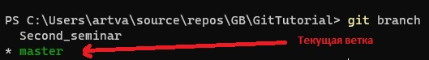
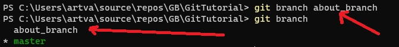
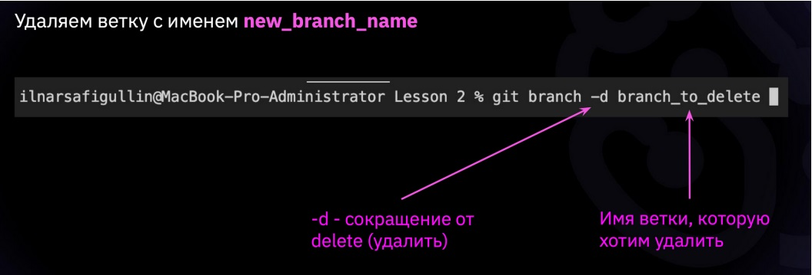
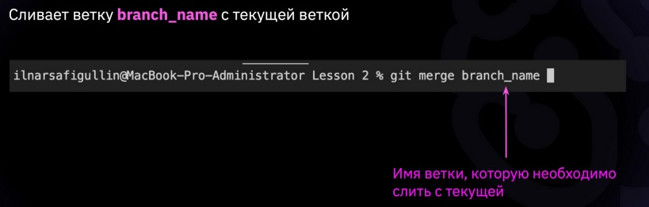
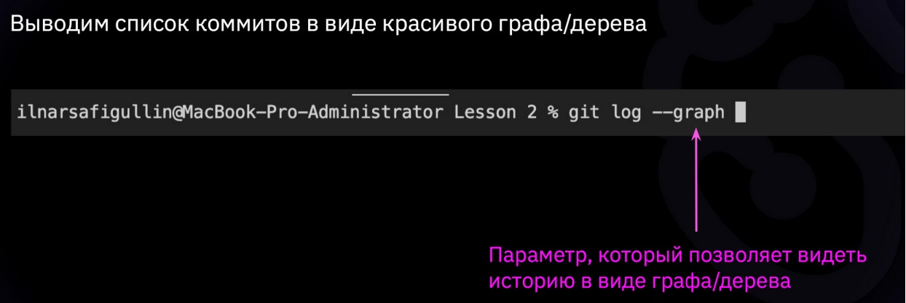
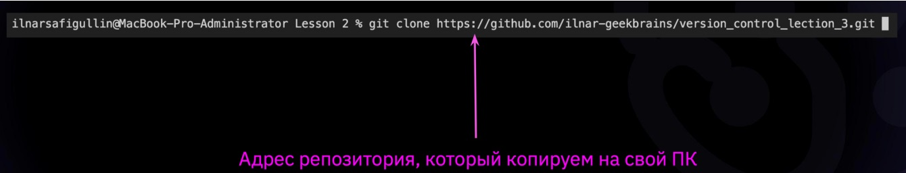
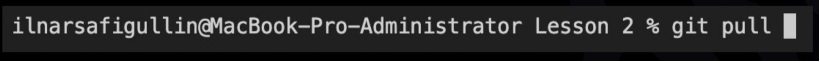
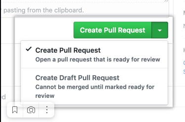

# My git instruction 
# Seminar 1 
* ***git --version*** - команда, показывающая версию Git.

  
 
 * ***git init*** - команда, инициализирующая файлы в текущей папке.

   

 * ***git status*** - команда, показывающая статус.

   

 * ***git add*** - команда, добавления изменений.

   

 * ***git commit*** - команда, которая сохраняет слепок текущего    состояния, добавленного в индекс с помощью команды git add.

    

 * ***git log*** - команда, вызывающая журнал изменений.

   

 * ***git checkout*** - команда, для переключения между версиями/ветками.
  

  * ***git diff*** - команда, показывающая разницу между текущим состоянием файла и сохранённым.
   

 # Seminar 2
* ***git branch*** - команда, показывающая список существующих веток, и указывающая на ветку в которой находимся в данный момент.
    

* ***git branch branch_name*** - команда, для создания новой ветки.
    

* ***git branch -d branch_name*** - команда, для  удаления ветки.
    

* ***git checkout branch_name*** - команда, для переключения между ветками.
    

* ***git merge branch_name*** - команда, для объединени ветки с branch_name с текущей веткой.
    

* ***git log --graph*** - команда, для отображения логов в виде древовидной структуры - графа.
    
    
 # Seminar 3
* ***git clone <url_addres_repo>*** – команда, для клонирования внешнего репозитория на локальный ПК.
 

 * ***git pull*** – команда, позволяет скачать все из текущего репозитория и пытается сделать merge с нашим локальным репозиторием.
 

 * ***pull request*** – команда для предложения изменений/запрос на вливание изменений в репозиторий
 
 

 Более подробно в полном [*руководстве*.](https://git-scm.com/book/ru/v2 "О системе контроля версий на русском")
 