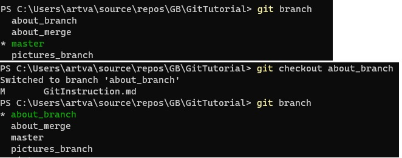

# My git instruction 
# Seminar 1 
* ***git --version*** - команда, показывающая версию Git.

 
 
 * ***git init*** - команда, инициализирующая файлы в текущей папке.

 

 * ***git status*** - команда, показывающая статус.

 

 * ***git add*** - команда, добавления изменений.

 

 * ***git commit*** - команда, которая сохраняет слепок текущего    состояния, добавленного в индекс с помощью команды git add.

  

 * ***git log*** - команда, вызывающая журнал изменений.

 

 * ***git checkout*** - команда, для переключения между версиями/ветками.

  
 * ***git diff*** - команда, показывающая разницу между текущим состоянием файла и сохранённым.

   

 # Seminar 3
* ***git clone <url_addres_repo>*** – команда, для клонирования внешнего репозитория на локальный ПК.
 
 Более подробно в полном [*руководстве*.](https://git-scm.com/book/ru/v2 "О системе контроля версий на русском")
 
 
 
 
